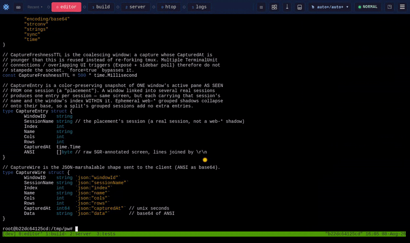

# webtmux

A web-based terminal with tmux-specific features. Access your tmux sessions from any browser with a visual pane layout, touch-friendly controls, and automatic scroll-to-copy-mode. Most importantly, see at a glance which of your windows are working and which are idle. Get notified when a window is ready for more work!

- Multiple ways ([Exposé](#windows-mosaic), [Pip, Preview Bar](#preview-and-picture-in-picture), [Sidebar](#windows-view-in-sidebar), [Recents Tabs](#toolbar-and-recent-tabs)) to [quickly monitor](#hover-previews) and access your tmux windows.
- [Get notified with visuals](#stoplights-and-work-alerts) when your tmux windows are done working, are prompting for input or are idle waiting for more work.
  - Perfect for working with AI coding agents - know exactly when they are done/need input
  - **setup required for feature to work**
- [Copy several things and paste them one at a time](#copy-buffers) - a list of copy buffers, one of which is the clipboard, that only grows when you are actually gathering.
- Take advantage of modern UI - Use Drag and Drop, Previews on hover etc to manage your tmux state.
- Controls mimic familiar tmux shortcuts - just with control+Option instead of the usual prefix.
- Discoverability of all features - no more searching for shortcuts or remembering commands
- Quickly access your most recent windows. Monitor any window, keeping it always in your view.

## Unique Features

### Windows View in Sidebar

A UI replacement for tmux Prefix+W. Lets you manage windows/sessions - create/delete, move between, reorder, link windows to sessions. All without having to remember complicated tmux commands.


- Toggle with Ctrl+Alt+W from anywhere.
- Hover-overlay to have it come up when you need it or pin to have it always stay open.
- Preview-before-commit browsing: arrow keys and hovering preview windows/sessions live in the real terminal.
  - Enter or click commits.
  - Esc puts everything back.
- Type-ahead search to find a window.
- Drag windows to reorder.
- Drag a window onto a session tab to link it there.
- Hover × kills a window — or just unlinks it when it lives in other sessions too.
- Double-click renames windows and sessions inline.
- "+" creates a session or a window.
- Session and window order persists.

### Toolbar and Recent Tabs

Manage your fleet of windows and keep your attention on the windows that matter. The most recent ones you accessed are immediately available in recent tabs - for preview or bringing into focus.


A tab flashes amber when its window has stopped working, and an arrow flashes when a window that is not currently visible needs attention. Viewing the window stops its flash.


- The toolbar has up to 5 (configurable) most-recently-used window tabs for quick access.
  - control+Option+N/P - used to navigate to the next/previous window in your most-recent list.
  - Remove a window from your most recents with the hover-revealed close button ×
  - Most recents persist across reloads
- Attention arrow (→) at the end of the strip counts and flashes for windows that need you but are visible nowhere; clicking it opens the most recent one for preview.
- App wide toggles:
  - Copy-mode indicator/toggle
  - a single **mouse capture** dropdown holding both gesture questions — `click+drag:` (who gets a mouse press, the program or a text selection) and `copymode on scroll:` (who gets the wheel).
  - save (⤓) button to download your buffer locally or remotely — whole scrollback by default, or just the visible screen
  - focus dots tell you which region you are in.
  - a hidden build-id chip (Ctrl+Alt+B, copies the build id when revealed).

### Windows Mosaic

Bring up a Mac-style Exposé view to see 4 or 9 windows at once. Syllable substring search for filtering and scroll to see additional windows. Order by most recent to quickly find what you were working on, or see status of multiple windows at once. A **Show** filter narrows the mosaic to one work status — working / needs you / idle — which turns it into a triage board when a dozen agents are running.


- Ctrl+Alt+E cycles a full-screen mosaic of every window across every session: 2×2 → 3×3 → closed
- On a Mac a trackpad pinch opens/closes it
- Live thumbnails and left click or arrow+Enter to start working on it
- Type to filter by name, with an optional toggle to search captured window content too
- Linked windows appear once; sort by session or recency

### Preview and Picture-in-Picture

Keep an eye on specific windows, even while you focus on others.


- "Preview" collects windows to keep an eye on. Toggle with Ctrl+Alt+I
  - A single window floats as a corner PiP box.
  - Two or more dock as a bar along a screen edge that reserves space instead of covering the terminal.
- Ctrl+Alt+I adds/removes the focused window.
- Ctrl+Alt+H hides/shows the preview while keeping the windows in it.
- Provides another way to quickly switch to high priority windows.

### Hover Previews

- Pointing at any window — recents tab, sidebar row, preview tile — previews it full-size in a real terminal region instantly for quick status check.


- The visible preview is temporary, move the mouse away or press Escape to go back to what you were doing.
- Commit to the new window with mouse left click or keyboard Enter.
- Previews wait for a fresh capture at the right pane geometry before painting, so you never see a stale or mis-sized screen.

### Stoplights and Work Alerts


- Webtmux renders a stoplight dot everywhere the window appears (recents tabs, sidebar rows, preview tiles, Exposé tiles): green = working, amber = prompting you, red = waiting for work, unfilled = not reporting.
- Windows self-report status via the tmux option `@wt_working`.
- When a window drops out of green while you're looking elsewhere, everything showing it flashes in the new color until you actually view it.
  - Alerts cover every window on the server, not just visible tabs.
- A bash prompt-hook installer ships in the repo so ordinary shells paint their own light automatically (see below), or you can hook into your agent framework (like Claude).

### Split View And Regions


- Split view: add side-by-side terminal regions (Ctrl+Alt+Enter), each an independent live tmux view backed by its own grouped session — watch two windows of the same server at once.
- One shared sidebar bound to whichever region is focused
- A draggable divider resizes regions.
- A new region auto-picks the most-recently-used window not already on screen; two regions never show the same window (occupied windows are greyed out in every switcher).
- Secondary regions switch sessions freely without dragging the primary or the console along; a split that gets synced onto a shared session self-heals.
- Close the focused region with Ctrl+Alt+X (the primary region can't be closed).

### Capture & preview infrastructure


- The server keeps one deduplicated capture buffer per tmux window, shared across all connections, with freshness coalescing so overlapping UI polls never storm tmux.
- Clients mirror it in a capture cache powering Exposé tiles, preview tiles, hover previews, and optimistic paint — switching windows paints the cached screen instantly while the live feed catches up. Captures of closed windows are pruned.

### State persistence


- Shared UI state lives in the tmux server itself (global option `@wt_state`), surviving reloads, reconnects, and webtmux restarts, and shared by every browser: sidebar prefs, session order, renderer choice, Exposé/preview/toolbar prefs, split window assignments, the recents strip, access recency, the chosen save directory, and the primary region's window.
- Per-tab state (focused view, split widths) stays in the browser tab so two browsers don't fight over focus. A reload returns every region to the exact session+window it was on.

### Copy Buffers

Copy several things, then paste them one at a time. A system clipboard holds exactly one thing, so gathering three snippets out of a scrollback normally means three round trips — and every intermediate copy silently destroys the last one.



**The focused buffer is the clipboard.** Focusing a row writes it to the system clipboard, so this is not a second clipboard fighting the real one — it is a way to choose what the real one holds. Cmd/Ctrl+V keeps working everywhere, including in other apps.

**The list only grows when you are actually gathering.** Whether a copy adds a buffer or reuses one is decided by a single question — has the focused buffer been pasted yet?

- Copy again **before** pasting and the new text becomes a buffer of its own; nothing you collected is lost.
- Copy again **after** pasting and it replaces the buffer you just used — so ordinary copy-paste-copy-paste never grows the list, and the panel stays one row if you never want this feature.
- The focused row says which of the two will happen next, so it is never a surprise.

**A copy shows you where it landed.** With the panel shut, copying floats it in for a couple of seconds: always floating (never mounted, so no terminal is resized), never taking the keyboard, and dismissed early by anything else you do — a keystroke, Escape, a click, a scroll. A panel you opened yourself is left alone entirely: it is never auto-collapsed, because it was never auto-shown. Point at a peeking panel to hold it open, or click into it and it becomes a normal open panel.

- Toggle with Ctrl+Alt+= from anywhere (tmux's `Prefix+=`, choose-buffer), or click the toolbar's NORMAL/COPY pill — which also carries a count once you are holding more than one buffer.
- The same panel furniture as the windows sidebar: float or mount, pin or auto-hide, ↑/↓ to walk the rows.
- Each row shows enough of its text to identify it, with the line and character count for anything longer; hover for a bigger excerpt.
- "+" adds an empty buffer, a hover × removes one, and **Clear** keeps the focused buffer — so clearing the list never changes what Cmd/Ctrl+V will paste.
- Every way of copying feeds it: Cmd/Ctrl+C over a selection, and tmux's own copy (a mouse drag in copy mode, or `y`). Text copied in another app is adopted on paste, so the panel can never point at a buffer that is not what you just pasted.
- The copy/normal mode toggle lives in this panel too — you enter copy mode in order to fill these buffers, so they are one subject. Ctrl+Alt+[ still flips the mode directly.
- Buffers are per browser tab and survive a reload. They are deliberately **not** shared through the tmux server: text you copied is not UI arrangement, and sharing it with every other browser on the server is not this feature's decision to make.

### Copy, scroll & clipboard


- Smart copy-mode typing: in a scrolled-up pane, copy-mode motions keep working but ordinary typing drops back to the prompt — no keystrokes silently swallowed.
- Cmd/Ctrl+C copies and stays in copy mode (grab several regions — each one is kept, see [copy buffers](#copy-buffers)); Cmd/Ctrl+V exits copy mode first so the paste lands at the prompt; dragging to the pane edge auto-scrolls the buffer; selection highlight clears after copy.
- Clipboard copy works on plain-HTTP LAN access (falls back when the secure clipboard API is missing); large pastes no longer drop the connection.
- Scroll-mode choices including an "auto+" default and adaptive wheel modes; Ctrl+Alt+[ toggles copy/scrollback mode, and Ctrl+Alt+= opens the [copy buffers](#copy-buffers).
- **Click-and-drag selects text even over a program holding the mouse** (Claude Code, vim, htop) — no entering copy mode by hand first. The toolbar's mouse-capture dropdown sets who gets a press under `click+drag:`, in the same four steps as the wheel under `copymode on scroll:`: `app` (all to the program) / `buf` (all to the buffer) / `auto` (a program that asked for the mouse gets it) / `auto+` (the default: clicks reach the program, drags select). Shift-drag (⌥-drag on a Mac) still forces a selection in any mode.
- Starting a selection puts the pane in copy mode for you, so the indicator is honest and dragging to the pane edge scrolls for more. In `auto+`, clicking away drops back out of copy mode — the click after that reaches the program as usual.
- **Shift-click moves the end of the selection you already have** instead of starting a new one — the end you dragged from stays put, so an overshoot is one click to fix rather than a whole drag to repeat. Shift-drag keeps moving that end while held, and clicking past the anchor turns the selection around. Works over a mouse-grabbing program too, where it neither reaches the program nor drops the pane out of copy mode. With nothing selected, shift-drag still means "force a selection" as before.

### Save pane buffer to a file


- Toolbar ⤓ saves the focused pane's buffer — the **entire scrollback** (the default) or just the visible screen: download to the browser, or write a file on the machine webtmux runs on — container-aware, with the save location explained up front and configurable via `WEBTMUX_SAVE_DIR` / `WEBTMUX_PATH_MAP` / `WEBTMUX_HOME` / `WEBTMUX_IN_CONTAINER` (details in the save section below).

### Scrollback buffer size

- Toolbar ⛁ shows how many lines the focused window's panes can hold, how many
  they are holding, and a gauge that turns amber once a buffer is full — i.e.
  once tmux has already started dropping the oldest lines.
- **New windows** sets `history-limit` for everything created from then on
  (`set-option -g`), and says out loud that it leaves existing windows alone.
  That lasts only as long as the tmux *server* does, so **Also save it for future
  tmux servers** writes the line into your tmux config (`~/.config/tmux/tmux.conf`
  or `~/.tmux.conf`, whichever tmux actually loaded) and names the file it wrote.
  The rewrite is done on the machine tmux runs on, so it works when webtmux is in
  a container that cannot see your home directory.
- **Resize this window** changes an existing window, which tmux offers no command
  for: a pane's buffer is fixed when the pane is created. webtmux rebuilds the
  window's panes at the new size in place — same window, same name, same index,
  same shape — **and carries the existing scrollback across**, colours and all.
  A running program cannot be carried (a pty can't be reparented), but if tmux
  *launched* the window with a command (`#{pane_start_command}`) the rebuilt pane
  offers to start it again — ticked by default, naming the exact command, and
  clear that it restarts from scratch rather than resuming. A program you started
  by typing at a prompt is one tmux never saw, so it is simply killed and the
  confirmation says so. (To keep one, hand it to a new pane yourself with
  `reptyr`, then resize.)
- **Clear** empties every pane's history in the window (not just the visible
  one), leaving the screen and everything running untouched.
- Reading the sizes works on a read-only server (`-w` absent); changing them
  does not.

### Keyboard navigation & discoverability


- A shortcuts overlay (Ctrl+Alt+/) lists every hotkey with modifier labels matching your OS (⌃⌥ on Mac).
- Global Ctrl+Alt chords mirror tmux letters: W sidebar, P/N recents prev/next, ⇧P/⇧N walk the session's window list in index order, L alt-tab-style MRU cycle with deferred commit, comma rename, X close region, [ copy mode, = copy buffers, C new window (also ⌘⌥C on Mac), D drop current window from recents, Enter add split, E Exposé, I/H preview.
- Consistent custom tooltips everywhere; confirmations appear as a small popup next to the control you clicked, and only an explicit "Yes" acts.

### Terminal rendering & session plumbing


- Glyph fidelity: tmux clients attach UTF-8-clean and the DOM renderer is the default (WebGL opt-in), so box-drawing and pane borders render correctly; pure black terminal background.
- Honors a custom tmux socket and env-based detection (`WEBTMUX_SOCKET`, `WEBTMUX_SESSION`).
- Per-connection tmux controller threading: each browser region follows its pane's real tmux client by tty+pid, fixing wrong-client switches (including cross-container pty name collisions, backed by a pts-number reservation, `WEBTMUX_PTS_FLOOR`).

### Build, server & reliability

Discover which build you are running.


## Setting up the Busy/Working Stoplights

The stoplight contract is one tmux option, set on the window by whatever runs inside it:

```sh
tmux set -w -t "$TMUX_PANE" @wt_working 1     # green  — working
tmux set -w -t "$TMUX_PANE" @wt_working 2     # amber  — prompting: blocked until you answer
tmux set -w -t "$TMUX_PANE" @wt_working 0     # red    — waiting for work to do
tmux set -w -t "$TMUX_PANE" -u @wt_working    # unset  — unfilled dot, "not reporting"
```

**Always name the pane.** A bare `tmux set -w @wt_working …` is not "my window": with no `-t`,
tmux resolves the target from the CURRENT window of the session it picks — the window you are
LOOKING at. The two are the same window only while you are watching, so the writes look correct
right up until they matter: switch away from a long command and its finishing red lands on the
window you switched to, while the window that actually finished stays green. `$TMUX_PANE` is
exported by tmux into every pane and resolves to that pane's window, wherever you are looking.

That is the whole API: any script, agent hook, or build wrapper can write it, and every surface showing that window (recents tab, sidebar row, preview tile, Exposé tile) updates within ~500 ms. A drop out of green flashes everywhere the window appears until you view it — viewing it once is enough, even for a window linked into several sessions.

### Bash shells

Source the bundled prompt hooks from `~/.bashrc`:

```sh
[ -f /path/to/webtmux/install_stoplight_hooks_bash.sh ] && \
  source /path/to/webtmux/install_stoplight_hooks_bash.sh
```

The hooks only activate inside tmux and are idempotent. They paint green when a command starts (bash `DEBUG` trap), red when the prompt returns (`PROMPT_COMMAND`), and leave the window red when the shell exits so it is never stranded green. `exit`/`logout` never paint green, and tab-completion doesn't trigger them. Every write is addressed to `$TMUX_PANE`, so a command that finishes while you are looking at another window reddens (and flashes) the window it actually ran in.

`wt_stoplight_status` prints what the hooks installed in the current shell — the pane they address and the delegate list they resolved.

#### Launchers that own the light: `WT_STOPLIGHT_DELEGATES`

An agent or TUI that reports its own state is started by one foreground command that does not return until you quit it. Painted normally, that command latches the window green for the whole session and buries every write the agent makes. Name such launchers and the shell steps aside for them:

```sh
export WT_STOPLIGHT_DELEGATES='claude:pi:*mylauncher.sh*'
```

Colon-separated glob patterns, **empty by default** — which launchers exist is a property of your machine, not of webtmux. Each pattern is matched twice against every command:

- against the **whole command string**, so `*mylauncher.sh*` still matches when env-var prefixes or a `docker exec …` bury the real target in the middle;
- against the **basename of the first word**, so a bare `claude` matches `claude --resume` and `/opt/bin/claude`, but not `echo claude`.

Patterns cannot contain `:`. The variable is read live, so exporting a new value takes effect on the next command.

A fork that wants its own machines configured without pushing that list onto everyone can drop the same `export` into `scripts/stoplight-delegates.env.sh` beside the installer; it is sourced only when `WT_STOPLIGHT_DELEGATES` is unset, so the environment always wins. If delegation ever stops working, the symptom is a window stuck green for a whole agent session and it points nowhere near here — run `wt_stoplight_status`, which names the list and where it came from.

### Claude Code Integration

The recommended preferences: add this `hooks` block to `~/.claude/settings.json` (hooks run as children of the agent process in the window's own pane, so they inherit both `$TMUX` and `$TMUX_PANE` — keep the `-t "$TMUX_PANE"`, or the write follows whichever window you are looking at):

```json
{
  "hooks": {
    "UserPromptSubmit": [
      {
        "hooks": [
          {
            "type": "command",
            "command": "jq -r '.prompt // \"\"' | grep -q '^/' || tmux set -w -t \"$TMUX_PANE\" @wt_working 1"
          }
        ]
      }
    ],
    "PreToolUse": [
      {
        "hooks": [
          {
            "type": "command",
            "command": "tmux set -w -t \"$TMUX_PANE\" @wt_working 1"
          }
        ]
      }
    ],
    "PostToolUse": [
      {
        "hooks": [
          {
            "type": "command",
            "command": "tmux set -w -t \"$TMUX_PANE\" @wt_working 1"
          }
        ]
      }
    ],
    "Notification": [
      {
        "hooks": [
          {
            "type": "command",
            "command": "jq -r '.message // \"\"' | grep -qi 'waiting for your input' || tmux set -w -t \"$TMUX_PANE\" @wt_working 2"
          }
        ]
      }
    ],
    "Stop": [
      {
        "hooks": [
          {
            "type": "command",
            "command": "tmux set -w -t \"$TMUX_PANE\" @wt_working 0"
          }
        ]
      }
    ],
    "SessionStart": [
      {
        "hooks": [
          {
            "type": "command",
            "command": "tmux set -w -t \"$TMUX_PANE\" @wt_working 0"
          }
        ]
      }
    ],
    "SessionEnd": [
      {
        "hooks": [
          {
            "type": "command",
            "command": "tmux set -w -t \"$TMUX_PANE\" @wt_working 0"
          }
        ]
      }
    ]
  }
}
```

Two of the entries are guarded, and the guards matter:

- **UserPromptSubmit skips `/`-prefixed prompts.** Local slash commands (`/model`, `/cost`, …) are handled without a model turn, so no `Stop` ever follows — an unconditional green would latch until the next real turn ends, and the window would lie "working" while the agent sits idle. Slash-invoked _skills_ do run real turns and re-green via `PreToolUse` a moment later. (A `UserPromptSubmit` hook's stdout is injected into the model's context, so whatever you put here must stay silent — every command above prints nothing.)
- **Notification stays red on the idle-timer message.** Claude Code fires `Notification` both when it genuinely needs a decision (permission prompt, question — that's amber) and as a ~60s "waiting for your input" idle reminder after a turn ends (nothing is blocked — repainting that amber would flip every idle window to "needs me" a minute after `Stop` correctly made it red). Unmatched messages default to amber deliberately: a missed block is worse than a spurious one.

`SessionStart`/`SessionEnd`/`Stop` all paint red — "waiting for work" — so a window is never stranded green by a crash or exit. For the shell and agent hooks to compose without fighting, the shell must be told to step aside for the launch command: `export WT_STOPLIGHT_DELEGATES=claude` (see above) — otherwise the `claude` invocation itself sits green from launch to exit and hides every write the agent makes. If the agent runs inside a container where `tmux` can't be reached, keep the same hook shape but swap the `tmux set` for a small script that relays the value (and a window id, e.g. from a `WT_WINDOW` env var passed at launch) to a listener on the host that runs the `tmux set` there.

### Hooking up Tools that own their window's light

For agents and long-running TUIs that report their own status, two escape hatches keep the shell hooks from fighting them:

- `WT_STOPLIGHT_SUPPRESS=1` in the environment disables the shell hooks entirely.
- `WT_STOPLIGHT_DELEGATES` lists launcher commands whose whole lifetime owns the light; the shell skips painting green for them so the tool's own writes shine through. Empty by default — [add your launcher's pattern](#launchers-that-own-the-light-wt_stoplight_delegates).

An agent lifecycle integration is then just three writes: `1` when work starts, `2` from a "needs your input" hook, `0` when it goes idle or exits.

## Quick Start (Sprite)

Deploy webtmux as a service on [Sprite](https://sprites.app):

```bash
sudo curl -fsSL https://github.com/sparant/webtmux/releases/latest/download/webtmux-linux-amd64 \
  -o /usr/local/bin/webtmux && \
  sudo chmod +x /usr/local/bin/webtmux && \
  sprite-env services create webtmux \
    --cmd /usr/local/bin/webtmux \
    --args '-w,tmux,new-session,-A,-s,main' \
    --http-port 8080
```

The binary comes from the latest [GitHub release](https://github.com/sparant/webtmux/releases) of this fork (`builds/` is untracked on `local-main`, so there is no raw-URL download). To build it yourself instead: clone the fork, check out `local-main` (the default branch), and run `make cross-compile` — the binary lands at `builds/webtmux-linux-amd64`.

## Running webtmux on another machine — `webtmux-launch`

One command on your laptop, against any box you can already SSH to:

```bash
webtmux-launch linuxbox
```

That works out which webtmux the target needs, installs it over the SSH
connection, starts it, tunnels the port back to `127.0.0.1`, keeps both alive
across drops, and opens your browser. **The target machine needs nothing but
`ssh` and `tmux`** — no internet, no `curl`, no pre-installed webtmux, no
systemd unit. The `<ssh-target>` is passed to `ssh` verbatim, so
`~/.ssh/config` aliases, `user@host` forms and `ProxyJump` bastions all work,
and you get one auth prompt for the whole session.

**How it decides what to connect to**, in order:

1. **A webtmux already running on the target wins.** Exactly one: it adopts that,
   and nothing is deployed or started.
2. **Several running** — it asks which, listing port, session and uptime. With no
   terminal (a script) it refuses rather than guessing, and names `--remote-port`.
3. **None running** — it attaches to an existing tmux session; several sessions
   means the same question, answerable up front with `--session`. No sessions at
   all: it creates one.
4. **Only then does a binary matter** — see "Which webtmux gets installed" below.

If a webtmux is **already running** on that box, the launcher adopts it —
tunnel only, nothing deployed, nothing started, and quitting the launcher leaves
your long-lived instance running. Otherwise it starts its own, and that one is
disposable on purpose: it dies with the SSH connection, and the tmux session
(created detached, owned by the tmux server) survives. A dropped link costs one
SSH handshake to recover, with your panes exactly where they were. The URL is
generated once per target and reused forever, so a browser tab left open
reconnects on its own.

**Getting the launcher.** Build it from a checkout:

```bash
make launcher          # -> builds/webtmux-launch-{darwin-arm64,darwin-amd64,linux-amd64}
```

Pre-built launcher binaries are published as release assets from
`https://github.com/sparant/webtmux/releases` — download the one for your
laptop's platform, `chmod +x`, and put it on your `PATH`. The launcher and
webtmux ship on independent cadences: a webtmux fix reaches every launcher
already installed with no launcher update at all.

Useful flags:

| Flag                               | Effect                                                                      |
| ---------------------------------- | --------------------------------------------------------------------------- |
| `--session <name>`                 | which tmux session to attach (default: the box's only session, else `main`) |
| `--no-browser`                     | print the URL instead of opening it                                         |
| `--auth`                           | keep basic auth on, for a shared multi-user box                             |
| `--fresh` / `--adopt-only`         | ignore a running instance / refuse to start one                             |
| `--webtmux-version vX.Y.Z\|latest` | which release to install                                                    |
| `--verbose`                        | echo the ssh command lines and say which binary source won                  |

**Which webtmux gets installed.** The launcher carries no webtmux payload. It
looks, in order:

1. **A webtmux already on the target**, reused when `--version` matches what this
   launcher expects — the cheapest outcome, and usually one you installed
   deliberately. A version it cannot confirm (a `dev` build, or `latest`) is
   never reused: an unknown build is not a saving.
2. **A directory you configured** — `--webtmux-source <dir>`, or
   `$WEBTMUX_LAUNCH_SOURCE`. If the asset for that platform is missing there,
   that is an **error**, never a silent fall back to downloading.
3. **A binary sitting next to the launcher itself**, so an unzipped directory of
   downloaded assets works with no flags at all.
4. **The GitHub release.** The target downloads it directly when it has
   `curl`/`wget` — that skips pushing ~12 MB through the SSH connection, and the
   sha256 is verified *on the target* before the binary is installed. A box with
   no egress falls back automatically to being fed over the connection the
   launcher already has, so **a target still never strictly needs internet.**

The version is **pinned** at build time (currently `v0.1.0`)
rather than tracking latest, so a launcher you have been using does not upgrade
your remote out from under you mid-session — `--webtmux-version` overrides.
Binaries land content-addressed under `~/.cache/webtmux/webtmux-<sha>`, so a
repeat launch transfers nothing and several versions coexist safely.

**Security model.** Both ends bind `127.0.0.1` and the URL carries a 32-character
secret path, so reaching the terminal needs either the SSH-authenticated tunnel
or a local account on one of the two machines. Stated plainly: _any local user on
either machine who learns the secret path gets a shell._ The secret is visible in
`ps` on both machines (it is a `--path` argument) and stored in
`~/.config/webtmux-launch/<target>.json`. For a shared box, use `--auth`.

### Developing against a local build

Point the launcher at a build directory instead of a release. `make
cross-compile` already writes exactly the filenames a release publishes, so a
checkout is a drop-in substitute — no manifest, no copy step:

```bash
make cross-compile
export WEBTMUX_LAUNCH_SOURCE=$PWD/builds
webtmux-launch testbox            # deploys what you just compiled
```

Or bake it in and skip the export entirely:

```bash
make cross-compile
make launcher-dev && ./builds/webtmux-launch testbox
```

Precedence, highest first: `--webtmux-binary <file>` › `--webtmux-source <dir>` ›
`$WEBTMUX_LAUNCH_SOURCE` › the `make launcher-dev` default › the GitHub release.
A configured-but-invalid directory is a **hard error**, never a quiet fallback
to downloading. Every run prints one line naming the source, its sha and how old
the build is — local mode cannot misreport what it deployed, but it cannot know
you forgot to run `make cross-compile`, so read that line when a fix "doesn't
take".

Note the trade a local source makes: it verifies the bytes against a hash
computed from those same bytes, which is an integrity check against a truncated
or racing read — **not** an authenticity check like the release's published
`SHA256SUMS`. That is the right trade for your own build output, and it is why
the source must always be configured explicitly and is never auto-detected.

The end-to-end suite (`make -C webtmux-launch e2e`) stands up a throwaway
sshd+tmux container and exercises probe, deploy, tunnel, adopt, split-view,
durability and reconnect against it — entirely offline.

## Installation

Manual installation, for when you want webtmux on a machine permanently rather
than launched on demand. If you just want to reach a remote tmux from your
laptop, `webtmux-launch` above is the shorter path.

### Prebuilt Binaries

Binaries are published as [release assets](https://github.com/sparant/webtmux/releases).
They are not committed to the repository — `builds/` is untracked, so cloning gets
you source, not a binary. The repo is public, so downloading needs no token and no
`gh`:

```bash
curl -fsSL -o webtmux \
  https://github.com/sparant/webtmux/releases/download/v0.1.0/webtmux-linux-amd64
chmod +x webtmux
./webtmux -w tmux new-session -A -s main
```

One asset per platform, named `webtmux-<os>-<arch>`:

| Platform              | Asset                   |
| --------------------- | ----------------------- |
| Linux (x64)           | `webtmux-linux-amd64`   |
| Linux (ARM64)         | `webtmux-linux-arm64`   |
| Linux (ARM)           | `webtmux-linux-arm`     |
| macOS (Intel)         | `webtmux-darwin-amd64`  |
| macOS (Apple Silicon) | `webtmux-darwin-arm64`  |
| FreeBSD (x64)         | `webtmux-freebsd-amd64` |

Swap `download/v0.1.0/` for `latest/download/` to always get the newest release —
the same redirect `webtmux-launch --webtmux-version latest` follows:

```bash
curl -fsSL -o webtmux \
  https://github.com/sparant/webtmux/releases/latest/download/webtmux-linux-amd64
```

Each release also carries a `SHA256SUMS` asset covering every binary in it. It is
a few hundred bytes, so verifying costs nothing:

```bash
curl -fsSL -O https://github.com/sparant/webtmux/releases/download/v0.1.0/SHA256SUMS
sha256sum --check --ignore-missing SHA256SUMS      # want: webtmux-linux-amd64: OK
```

(`--ignore-missing` because `SHA256SUMS` lists every platform and you downloaded
one. The name must match the asset name for the check to find it — download to
`webtmux-linux-amd64`, not `webtmux`, if you want to verify before renaming.)

### Installing on a fresh machine

Start to finish on a box that has never seen webtmux. Only the first step needs
root, and only if tmux isn't there already.

```bash
# 1. tmux is the one prerequisite — webtmux drives it, it does not replace it.
tmux -V || sudo apt-get install -y tmux        # or: brew install tmux

# 2. Fetch the asset for this machine, verify it, install it on PATH.
mkdir -p ~/.local/bin && cd "$(mktemp -d)"
BASE=https://github.com/sparant/webtmux/releases/download/v0.1.0
curl -fsSL -O $BASE/webtmux-linux-amd64        # match your os-arch from the table
curl -fsSL -O $BASE/SHA256SUMS
sha256sum --check --ignore-missing SHA256SUMS
install -m 755 webtmux-linux-amd64 ~/.local/bin/webtmux

# 3. PATH, if ~/.local/bin isn't on it yet.
case ":$PATH:" in *":$HOME/.local/bin:"*) ;; *)
  echo 'export PATH="$HOME/.local/bin:$PATH"' >> ~/.bashrc; export PATH="$HOME/.local/bin:$PATH";;
esac

# 4. Confirm what you installed — a real release says v0.1.0, not dev.
webtmux --version

# 5. First run, bound to loopback.
webtmux -a 127.0.0.1 -w tmux new-session -A -s main
```

**Bind loopback unless you mean otherwise.** The default address is `0.0.0.0`, and
authentication here is HTTP basic auth over plain HTTP — fine over an SSH tunnel or
on `127.0.0.1`, not something to face a LAN. `-a 127.0.0.1` plus
`ssh -L 8080:127.0.0.1:8080 host` is the safe remote story (and is exactly what
`webtmux-launch` automates).

Two platform notes:

- **The tmux protocol-version pinning in the Docker deploy does not apply to a
  native binary.** That pinning exists only because the container attaches to the
  *host's* tmux across a bind-mounted socket, and the two tmux builds must agree.
  A native webtmux talks to its own local tmux, so there is nothing to pin.
- **macOS:** the `darwin/arm64` binaries are ad-hoc signed by Go's linker even
  though they are cross-compiled from Linux, so they run on Apple Silicon as-is.
  A `curl`-downloaded binary does carry the quarantine xattr; if Gatekeeper
  objects, `xattr -d com.apple.quarantine webtmux` clears it. Downloading with
  `gh release download` avoids the xattr altogether.

**Or skip the target machine entirely.** If the reason you are installing webtmux
somewhere is to reach *that* machine's tmux from your laptop, `webtmux-launch`
above makes this whole section unnecessary — it fetches and installs webtmux on the
target itself over SSH, needing nothing there but `ssh` and `tmux`.

### Build from Source

```bash
# Clone the repository
git clone https://github.com/sparant/webtmux.git
cd webtmux

# Build for current platform
make build

# Or cross-compile for all platforms
make cross-compile
```

**No Go toolchain?** `make docker-artifact` builds in a pinned container instead
and writes `builds/webtmux-<os>-<arch>`:

```bash
make docker-artifact                             # -> builds/webtmux-linux-amd64
make docker-artifact DOCKER_PLATFORM=linux/arm64 # -> builds/webtmux-linux-arm64
```

The repo's `Dockerfile` is that build (`--target artifact`); it exports the binary
as a file rather than an image, so there is nothing to tag or clean up. It is also
the supported way to consume webtmux from another repo's image build: build the
artifact, then `COPY` it in — the binary is `CGO_ENABLED=0` static with embedded
assets, so it needs nothing from the builder image at runtime.

#### Reproducible builds

From v0.1.1, a released binary can be re-derived from its source by anyone:

```bash
make release-from-commit REF=v0.1.1   # -> builds/webtmux-* + SHA256SUMS
```

Compare the result against the release's published `SHA256SUMS` — they match, on
any machine, in any directory, at any time. The build needs only `git` and
`docker`; the Go toolchain is a pinned container, so there is nothing to install
and nothing to match by hand.

What makes that hold, since none of it is automatic:

- **The build stamp is the commit's own timestamp**, not the clock. `date` in a
  build makes every binary of one commit unique, which is precisely what stops
  anyone from checking a published one.
- **`-trimpath` and `-buildvcs=false`.** Without them a Go binary carries the
  directory it was compiled in (`-s -w` does *not* strip those), so the same
  source built in two places is two different binaries.
- **The compiler is pinned to an exact patch version** (`GO_VERSION` in the
  Makefile, matched by the Dockerfile and the launcher's Makefile — a test fails
  if the three drift apart). A different compiler is a different binary.
- **The source is a `git archive` of the ref**, so nothing uncommitted, untracked
  or left over from a previous build can reach the compiler. A build from a dirty
  tree stamps `-dirty` and cannot be mistaken for a tag.
- **`GOFLAGS`, `GOEXPERIMENT`, `GOAMD64`, `GOARM` and `GO386` are pinned** at
  their current defaults so a caller's environment cannot change the output.

```bash
make verify-repro REF=v0.1.1   # builds it twice, in two directories, and diffs
```

`verify-repro` is the check that matters: building twice in one place proves
almost nothing, because the inputs that leak are the ones that differ *between*
places. Binaries published before v0.1.1 were built without any of this and
cannot be reproduced — for those, the published `SHA256SUMS` is the only record.

## Usage

### Basic Usage

```bash
# Start with tmux (auto-generates credentials)
webtmux -w tmux new-session -A -s main

# Output:
# ========================================
#   Authentication Required (default)
#   Username: admin
#   Password: <random-32-char-password>
# ========================================
```

### Custom Credentials

```bash
webtmux -w -c user:password tmux new-session -A -s main
```

### Disable Authentication (not recommended)

```bash
webtmux -w --no-auth tmux new-session -A -s main
```

### Common Options

| Flag                         | Description                                                |
| ---------------------------- | ---------------------------------------------------------- |
| `-w, --permit-write`         | Allow input to the terminal (required for interactive use) |
| `-p, --port PORT`            | Port to listen on (default: 8080)                          |
| `-a, --address ADDR`         | Address to bind to (default: 0.0.0.0)                      |
| `-c, --credential USER:PASS` | Set custom credentials for HTTP Basic Auth                 |
| `--no-auth`                  | Disable authentication (NOT RECOMMENDED)                   |
| `--ws-origin REGEX`          | Regex for allowed WebSocket origins                        |
| `-t, --tls`                  | Enable TLS/SSL                                             |
| `--tls-crt FILE`             | TLS certificate file                                       |
| `--tls-key FILE`             | TLS key file                                               |
| `-r, --random-url`           | Add random string to URL path                              |
| `--reconnect`                | Enable automatic reconnection                              |
| `--once`                     | Accept only one client, then exit                          |

Run `webtmux --help` for all available options.

There is **no config file**. Every option is a flag, and every flag also has a
`GOTTY_*` environment variable (shown in `--help`) — so a deployment configures
webtmux with flags, env, or both. The inherited gotty `--config` flag and its
`~/.gotty` HCL file were removed: nothing used them, and they were the sole
reason for three unmaintained dependencies.

### Saving a pane buffer to a file (and running in a container)

The toolbar's ⤓ button either downloads the focused pane's buffer to your
browser, or writes it to a file **on the machine tmux runs on** — which is the
machine running `webtmux`, and those are not always the same filesystem.

The dropdown asks **which buffer** first, and defaults to the whole one:

| Scope                       | What you get                                                                          |
| --------------------------- | ------------------------------------------------------------------------------------- |
| **Entire scrollback buffer** (default) | Everything tmux still holds for that pane — `capture-pane -S -`, so the build output that scrolled past hours ago comes too. Bounded by tmux's own `history-limit` |
| **Visible screen only**     | Just the rows on screen right now — the same snapshot the Exposé thumbnails use        |

The choice applies to both destinations, and resets to the whole buffer every
time the menu opens: a scope is a decision about one save, not a preference, and
"I asked for the log and got the last 24 rows" is the failure worth designing
out. The download confirms how much text actually came out (lines and size),
because a screenful looks exactly like a complete save until you open the file.

Reading a scrollback is a read like any other capture, so it works on a
read-only server (one started without `-w`) — which is the only kind of save
such a server can offer.

The common trap is running webtmux in a container that mounts only the tmux
control socket. tmux then reports pane directories as _host_ paths
(`/home/you/Projects`) that the writing process cannot see, and a relative save
fails on a directory you can see perfectly well in your own shell. webtmux now
detects this: the save dropdown asks the server where a save would land and says
so up front (naming both directories), and a failed save explains which machine
is missing the directory rather than surfacing a raw `open` error.

When webtmux is containerized and no shared directory is known, it does not
guess: a container's own filesystem is always writable, so saving there would
report success for a file that dies with the container. Instead the dropdown
**asks** — "name a directory as webtmux sees it (e.g. `/data`), mounted from
outside" — checks that it exists and is writable, and remembers it (in the shared
tmux UI state, so every client on that server gets the answer). A remembered
directory that later disappears re-opens the question rather than silently
redirecting your file. Downloading to your browser needs no directory at all.

An operator can answer the question up front instead, by mounting a directory
into the container and naming it in `WEBTMUX_SAVE_DIR`; that variable is how
webtmux knows a directory is shared. Mounting a whole home directory would also
work and is deliberately not the advice — it is far more of the filesystem than
saving a text file needs. Four environment variables adjust the resolution:

| Variable               | Effect                                                                                                                                                                                                                                                                                                                   |
| ---------------------- | ------------------------------------------------------------------------------------------------------------------------------------------------------------------------------------------------------------------------------------------------------------------------------------------------------------------------ |
| `WEBTMUX_PATH_MAP`     | `host=server[,host2=server2]` prefix rewrites, applied to the pane's directory and to absolute paths you type — e.g. `/home/you/Projects=/data`                                                                                                                                                                     |
| `WEBTMUX_SAVE_DIR`     | Declares a **shared** directory and enables server-side saving in a container; relative saves land here when the pane's own directory isn't visible. Created if missing. Outside a container this defaults to `$HOME`, then the process's working directory. A directory the user names in the dropdown takes precedence |
| `WEBTMUX_HOME`         | What `~` expands to. Unset inside a container, `~` is refused rather than expanded to the image's own home                                                                                                                                                                                                               |
| `WEBTMUX_IN_CONTAINER` | `1`/`0` to override container auto-detection, which only affects the _wording_ of the explanation                                                                                                                                                                                                                        |

### Knowing which window needs you

A window can report what it is doing by setting a tmux option on itself:

```sh
tmux set -w -t "$TMUX_PANE" @wt_working 1     # green  — working
tmux set -w -t "$TMUX_PANE" @wt_working 2     # amber  — prompting: blocked until you answer
tmux set -w -t "$TMUX_PANE" @wt_working 0     # red    — waiting for work to do
tmux set -w -t "$TMUX_PANE" -u @wt_working    # unfilled — not reporting
```

Anything running in the window can do this — a shell prompt hook, an agent's
start/stop hooks, a script wrapping a long build. webtmux shows it as a stoplight
dot everywhere a window appears: the recent tabs, the sidebar's window list, the
preview thumbnails, Exposé.

The `-t "$TMUX_PANE"` is not optional. Without it tmux writes to whichever window
is CURRENT — the one you are looking at — so the light is correct only while you
are watching it, which is the one time you don't need it.

The dot tells you the state; the **flash** tells you it _changed_. When a window
drops out of green while you are looking somewhere else, everything showing that
window starts flashing in the colour it changed to — the tab, the sidebar row, the
preview tile's border — and keeps flashing until you go and look at it. There is
no expiry: a signal that gives up after thirty seconds is the one you miss when
you step away.

Five recent tabs cannot hold every window that stops, so the strip ends in an
**attention arrow** (→) whenever a window needs you and has no tab, no preview
tile and no region of its own. It carries the count and flashes like the tabs do,
and clicking it opens the window list on the most recent of them, previewed in a
terminal region. Nothing switches until you press Enter or click the row; Escape
puts everything back. Between the flashes and the arrow, "nothing is blinking"
means "nothing needs you" — which is what makes any of it worth watching.

## Architecture

```
Browser                              Go Backend
+------------------+                +------------------+
| xterm.js         |<--WebSocket-->| webtty core      |<--PTY--> tmux
| Lit.js Sidebar   |   (extended)  | tmux controller  |
| Touch Controls   |               |                  |
+------------------+                +------------------+
```

### Extended WebSocket Protocol

WebTmux extends the gotty protocol with tmux-specific message types:

**Client -> Server:**

- `5` TmuxSelectPane - Switch to pane by ID
- `6` TmuxSelectWindow - Switch to window by ID
- `7` TmuxSplitPane - Split current pane (h/v)
- `8` TmuxClosePane - Close pane by ID
- `9` TmuxCopyMode - Enter/exit copy mode
- `B` TmuxScrollUp - Scroll up in copy mode
- `C` TmuxScrollDown - Scroll down in copy mode
- `D` TmuxNewWindow - Create new window
- `S` TmuxScrollbackRequest - Read a window's entire pane buffer (its CONTENTS)
- `T` TmuxHistoryInfoRequest - Read a window's scrollback SIZE and usage
- `U` TmuxHistoryAction - Set the default (for this tmux server, or persisted to
  tmux.conf) / resize / clear a scrollback buffer

**Server -> Client:**

- `7` TmuxLayoutUpdate - Full layout JSON
- `9` TmuxModeUpdate - Copy mode state
- `E` TmuxScrollbackData - A window's entire pane buffer, base64
- `F` TmuxHistoryInfo - Scrollback sizes/usage + the outcome of an action

## Development

### Project Structure

```
webtmux/
├── main.go                 # CLI entry point
├── server/                 # HTTP server & WebSocket handlers
├── webtty/                 # WebTTY protocol implementation
├── pkg/tmux/               # Tmux controller
├── backend/localcommand/   # PTY backend
├── bindata/static/         # Embedded web assets
│   ├── js/
│   │   ├── webtmux.js      # Main frontend
│   │   └── components/     # Lit.js web components
│   └── index.html
└── resources/              # Source assets (for development)
```

### Building

```bash
# Development build (copies fresh assets)
make dev

# Production build
make build

# Cross-compile all platforms
make cross-compile

# The same, in the pinned container — no local Go needed
make docker-cross-compile

# Cross-compile + builds/SHA256SUMS, then print the gh publish command
make release-binaries

# Create release archives (tarballs — predates GitHub Releases)
make release

# Check bindata/static still matches resources/ (also run by `make test`)
make verify-assets
```

#### Cutting a release

Tag first, then build **the tag** — not the checkout:

```bash
git tag -a v0.1.1 -m "webtmux v0.1.1"
make release-from-commit REF=v0.1.1
./builds/webtmux-linux-amd64 --version    # must say v0.1.1 exactly
```

`release-from-commit` compiles a `git archive` of the ref in the pinned
container, writes all six binaries plus `SHA256SUMS`, and checks them. Because
the source and every stamp come from the ref, the output is byte-identical to
what anyone else building that tag gets — see *Reproducible builds* above. It
needs no local Go, and it does not care what is checked out or how far past the
tag `HEAD` has moved.

`make release-binaries` is the older local-toolchain path and still works; it
requires the pinned Go version (`make check-toolchain` explains the mismatch) and
prints the `gh release create` command rather than running it, so the assets can
be reviewed first. That command passes `--repo $(RELEASE_REPO)` because `gh`
cannot infer the target from a remote in every checkout — override
`RELEASE_REPO` if you publish to a different fork.

Two rules the launcher depends on:

- **Upload `SHA256SUMS` as its own asset.** The launcher fetches it before deciding
  whether to download a 12 MB binary; without it that cheap path is gone.
- **Never rename the `webtmux-<os>-<arch>` assets.** Their names are the interface
  the launcher builds download URLs from. Adding a platform is safe; renaming or
  removing one breaks every launcher already distributed.

Launcher binaries release on their own cadence — include `webtmux-launch-*` assets
only when the launcher itself changed, and build them *after* `release-binaries`
(`cross-compile` cleans `builds/`).

### Tech Stack

- **Backend**: Go, gorilla/websocket
- **Frontend**: xterm.js, Lit.js, Tailwind CSS (CDN)
- **Embedded Assets**: Go 1.16+ embed directive

## Credits

WebTmux is a fork of [gotty](https://github.com/yudai/gotty) by Iwasaki Yudai.

## License

MIT License - See [LICENSE](LICENSE) file for details.
