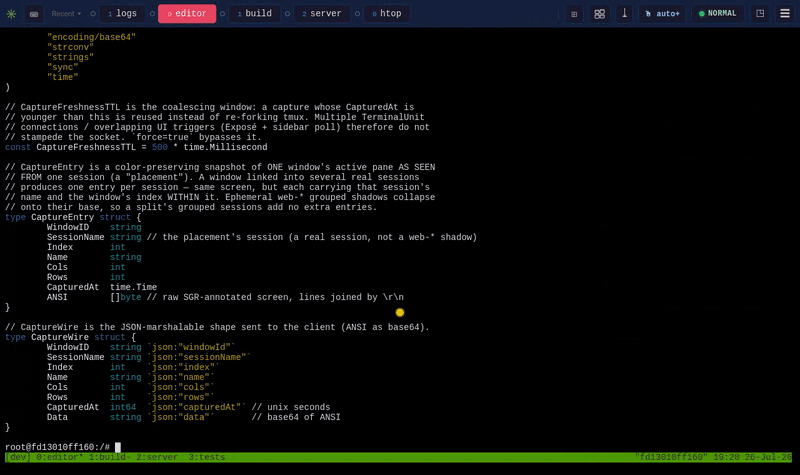
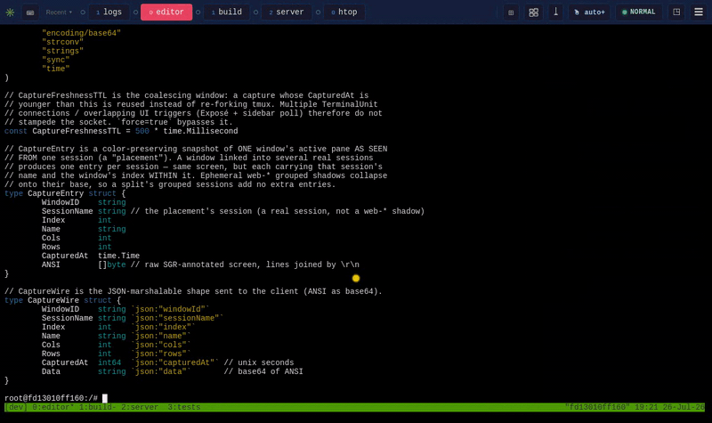
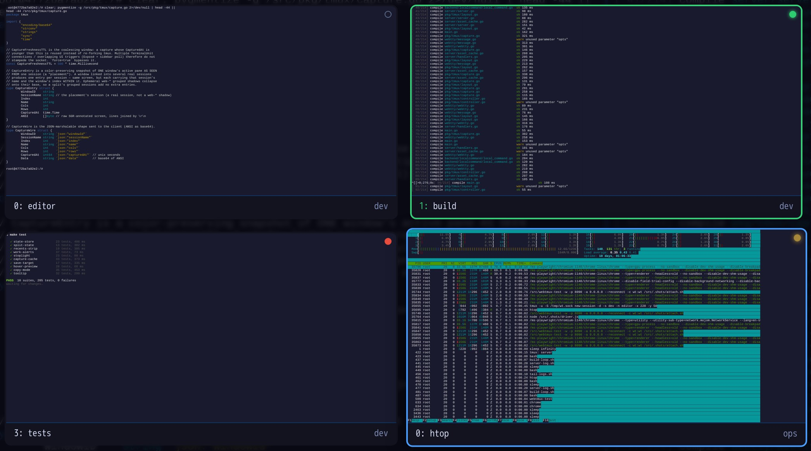
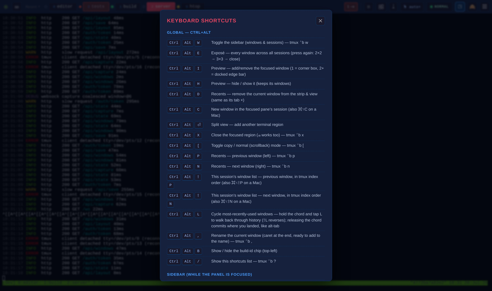
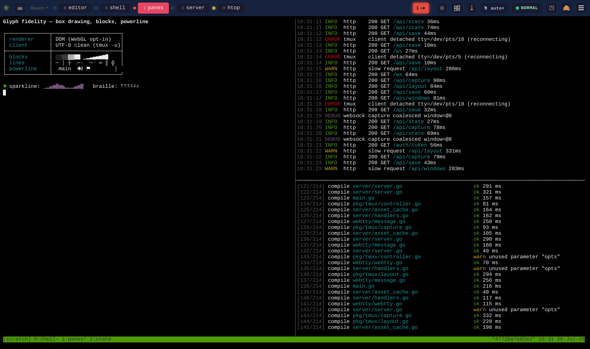

# webtmux

A web-based terminal with tmux-specific features. Access your tmux sessions from any browser with a visual pane layout, touch-friendly controls, and automatic scroll-to-copy-mode.

- Multtiple ways (Exposé, Pip, Preview Bar) for quick monitoring and status of your tmux windows.
- Take advantage of modern UI - Use Drag and Drop, Previews on hover etc to manage your tmux state.
- Controls mimick familiar tmux shortcuts - just with control+Option instead of the usual prefix.
- Discoverability of all features - no more searching for shortcuts or remembering commands
- Get notified with visuals when your tmux windows are done working and idle waiting for more work (perfect for working with AI coding agents - know exactly when they are done/need input) **setup required for feature to work**
- Quickly access your most recent windows. Monitor any window keeping it always in your view

## Unique Features

### Windows View in Sidebar

A UI replacement for tmux Prefix+W. Lets you manage windows/sessions - create/delete, move between, reorder, link windows to sessions. All without having to remember complicated tmux commands.


- Toggle with Ctrl+Alt+W from anywhere
- Hover-overlay to have it come up when you need it or pin to have it always stay open
- Preview-before-commit browsing: arrow keys and hovering preview windows/sessions live in the real terminal
  - Enter or click commits
  - Esc puts everything back
- Type-ahead search to find a window
- Drag windows to reorder
- Drag a window onto a session tab to link it there
- Hover × kills a window — or just unlinks it when it lives in other sessions too
- Double-click renames windows and sessions inline
- "+" creates a session or a window
- session and window order persists

### Toolbar and Recent Tabs

Manage your fleet of windows and keep your attention on the widnows that matter. The most recents you accessed are immediately avaialble in recent tabs - for preview or bringing into focus.


A tab flashes amber when its window has stopped working and an arrow flashes when a window not currently visible need addtion. Viewing the window stops its flash.


- The Toolbar has up to 5(configurable) most-recently-used window tabs for quick access.
  - control+Option+N/P - used to Navigate to next previous in your most recent list.
  - Move from your most recents by a hover revealing close button ×
  - Most recents persist across reloads
- Attention arrow (→) at the end of the strip counts and flashes for windows that need you but are visible nowhere; clicking it opens the most recent one for preview.
- App wide toggles:
  - Copy-mode indicator/toggle
  - scroll-mode toggle.
  - mouse click/drag ("sel") toggle — who gets a mouse press, the program or a text selection.
  - save (⤓) button to download your buffer locally or remotely
  - focus dots tell you what region you are in.
  - a hidden build-id chip (Ctrl+Alt+B, copies the build id when revealed).

### Exposé (window mosaic)

Bring up a mac style Exposé view to see 4 or 9 windows at once. Syllable substring search for filtering. scroll to others. Ordering by most recent lets you quickly find what you were working on, and see status of multiple windows at once.



- Ctrl+Alt+E cycles a full-screen mosaic of every window across every session: 2×2 → 3×3 → closed
- Ln a Mac a trackpad pinch opens/closes it
- Live thumbnails and left click or arrow+Enter to start working on it
- Type to filter by name, with an optional toggle to search captured window content too
- Linked windows appear once; sort by session or recency

### Preview / picture-in-picture


Keep an eye on specific windows, even while you focus on others.

- "Preview" collects windows to keep an eye on: one window floats as a corner PiP box; two or more dock as a bar along a screen edge that reserves space instead of covering the terminal.
- Ctrl+Alt+I adds/removes the focused window; Ctrl+Alt+H hides/shows the preview without losing it; tiles are read-only and click-to-switch.
- The single-window PiP blanks itself while the focused region already shows that window, and reappears when you move away.

### Hover previews

- Pointing at any window — recents tab, sidebar row, preview tile, — previews it full-size in a real terminal region instantly for quick status check.



- The visible preview is temporary, move the mouse away or press Escape to go back to what you were doing.
- or commit to the new window with click/Enter
- Previews wait for a fresh capture at the right pane geometry before painting, so you never see a stale or mis-sized screen.

### Stoplights & work alerts


- Windows self-report status via the tmux option `@wt_working`; webtmux renders a stoplight dot everywhere the window appears (recents tabs, sidebar rows, preview tiles, Exposé tiles): green = working, amber = prompting you, red = waiting for work, unfilled = not reporting. Hovering any dot shows the full color key.
- When a window drops out of green while you're looking elsewhere, everything showing it flashes in the new color until you actually view it — no timeout. Alerts cover every window on the server, not just visible tabs; reduced-motion users get a solid ring instead of blinking.
- A bash prompt-hook installer ships in the repo so ordinary shells paint their own light automatically (see below).

### Split view & regions


- Split view: add side-by-side terminal regions (Ctrl+Alt+Enter), each an independent live tmux view backed by its own grouped session — watch two windows of the same server at once.
- One shared sidebar bound to whichever region is focused
- a draggable divider resizes regions.
- A new region auto-picks the most-recently-used window not already on screen; two regions never show the same window (occupied windows are greyed out in every switcher).
- Secondary regions switch sessions freely without dragging the primary or the console along; a split that gets synced onto a shared session self-heals.
- Close the focused region with Ctrl+Alt+X (the primary region can't be closed).

### Capture & preview infrastructure



- The server keeps one deduplicated capture buffer per tmux window, shared across all connections, with freshness coalescing so overlapping UI polls never storm tmux.
- Clients mirror it in a capture cache powering Exposé tiles, preview tiles, hover previews, and optimistic paint — switching windows paints the cached screen instantly while the live feed catches up. Captures of closed windows are pruned.

### State persistence


- Shared UI state lives in the tmux server itself (global option `@wt_state`), surviving reloads, reconnects, and webtmux restarts, and shared by every browser: sidebar prefs, session order, renderer choice, Exposé/preview/toolbar prefs, split window assignments, the recents strip, access recency, the chosen save directory, and the primary region's window.
- Per-tab state (focused view, split widths) stays in the browser tab so two browsers don't fight over focus. A reload returns every region to the exact session+window it was on.

### Copy, scroll & clipboard


- Smart copy-mode typing: in a scrolled-up pane, copy-mode motions keep working but ordinary typing drops back to the prompt — no keystrokes silently swallowed.
- Cmd/Ctrl+C copies and stays in copy mode (grab several regions); Cmd/Ctrl+V exits copy mode first so the paste lands at the prompt; dragging to the pane edge auto-scrolls the buffer; selection highlight clears after copy.
- Clipboard copy works on plain-HTTP LAN access (falls back when the secure clipboard API is missing); large pastes no longer drop the connection.
- Scroll-mode choices including an "auto+" default and adaptive wheel modes; Ctrl+Alt+[ toggles copy/scrollback mode.
- **Click-and-drag selects text even over a program holding the mouse** (Claude Code, vim, htop) — no entering copy mode by hand first. The toolbar's "sel" button cycles who gets a press, in the same four steps as the scroll toggle: `app` (all to the program) / `buf` (all to the buffer) / `auto` (a program that asked for the mouse gets it) / `auto+` (the default: clicks reach the program, drags select). Shift-drag (⌥-drag on a Mac) still forces a selection in any mode.
- Starting a selection puts the pane in copy mode for you, so the indicator is honest and dragging to the pane edge scrolls for more. In `auto+`, clicking away drops back out of copy mode — the click after that reaches the program as usual.

### Save pane buffer to a file


- Toolbar ⤓ saves the focused pane's scrollback: download to the browser, or write a file on the machine webtmux runs on — container-aware, with the save location explained up front and configurable via `WEBTMUX_SAVE_DIR` / `WEBTMUX_PATH_MAP` / `WEBTMUX_HOME` / `WEBTMUX_IN_CONTAINER` (details in the save section below).

### Keyboard navigation & discoverability



- A shortcuts overlay (Ctrl+Alt+/) lists every hotkey with modifier labels matching your OS (⌃⌥ on Mac).
- Global Ctrl+Alt chords mirror tmux letters: W sidebar, P/N recents prev/next, ⇧P/⇧N walk the session's window list in index order, L alt-tab-style MRU cycle with deferred commit, comma rename, X close region, [ copy mode, C new window (also ⌘⌥C on Mac), D drop current window from recents, Enter add split, E Exposé, I/H preview.
- Consistent custom tooltips everywhere; confirmations appear as a small popup next to the control you clicked, and only an explicit "Yes" acts.

### Terminal rendering & session plumbing



- Glyph fidelity: tmux clients attach UTF-8-clean and the DOM renderer is the default (WebGL opt-in), so box-drawing and pane borders render correctly; pure black terminal background.
- Honors a custom tmux socket and env-based detection (`WEBTMUX_SOCKET`, `WEBTMUX_SESSION`).
- Per-connection tmux controller threading: each browser region follows its pane's real tmux client by tty+pid, fixing wrong-client switches (including cross-container pty name collisions, backed by a pts-number reservation, `WEBTMUX_PTS_FLOOR`).

### Build, server & reliability

Discover what build you are running on.


## Setting up the Busy/Working Stoplights

The stoplight contract is one tmux option, set on the window by whatever runs inside it:

```sh
tmux set -w @wt_working 1     # green  — working
tmux set -w @wt_working 2     # amber  — prompting: blocked until you answer
tmux set -w @wt_working 0     # red    — waiting for work to do
tmux set -w -u @wt_working    # unset  — unfilled dot, "not reporting"
```

That is the whole API: any script, agent hook, or build wrapper can write it, and every surface showing that window (recents tab, sidebar row, preview tile, Exposé tile) updates within ~500 ms. A drop out of green flashes everywhere the window appears until you view it.

### Bash shells

Source the bundled prompt hooks from `~/.bashrc`:

```sh
[ -f /path/to/webtmux/install_stoplight_hooks_bash.sh ] && \
  source /path/to/webtmux/install_stoplight_hooks_bash.sh
```

The hooks only activate inside tmux and are idempotent. They paint green when a command starts (bash `DEBUG` trap), red when the prompt returns (`PROMPT_COMMAND`), and leave the window red when the shell exits so it is never stranded green. `exit`/`logout` never paint green, and tab-completion doesn't trigger them.

### Claude Code Integration

The recommended preferences: add this `hooks` block to `~/.claude/settings.json` (hooks run in the window's own shell, which inherits `$TMUX`, so a plain `tmux set -w` lands on the right window):

```json
{
  "hooks": {
    "UserPromptSubmit": [
      {
        "hooks": [
          {
            "type": "command",
            "command": "jq -r '.prompt // \"\"' | grep -q '^/' || tmux set -w @wt_working 1"
          }
        ]
      }
    ],
    "PreToolUse": [
      {
        "hooks": [{ "type": "command", "command": "tmux set -w @wt_working 1" }]
      }
    ],
    "PostToolUse": [
      {
        "hooks": [{ "type": "command", "command": "tmux set -w @wt_working 1" }]
      }
    ],
    "Notification": [
      {
        "hooks": [
          {
            "type": "command",
            "command": "jq -r '.message // \"\"' | grep -qi 'waiting for your input' || tmux set -w @wt_working 2"
          }
        ]
      }
    ],
    "Stop": [
      {
        "hooks": [{ "type": "command", "command": "tmux set -w @wt_working 0" }]
      }
    ],
    "SessionStart": [
      {
        "hooks": [{ "type": "command", "command": "tmux set -w @wt_working 0" }]
      }
    ],
    "SessionEnd": [
      {
        "hooks": [{ "type": "command", "command": "tmux set -w @wt_working 0" }]
      }
    ]
  }
}
```

Two of the entries are guarded, and the guards matter:

- **UserPromptSubmit skips `/`-prefixed prompts.** Local slash commands (`/model`, `/cost`, …) are handled without a model turn, so no `Stop` ever follows — an unconditional green would latch until the next real turn ends, and the window lies "working" while the agent sits idle. Slash-invoked _skills_ do run real turns and re-green via `PreToolUse` a moment later. (A `UserPromptSubmit` hook's stdout is injected into the model's context, so whatever you put here must stay silent — every command above prints nothing.)
- **Notification stays red on the idle-timer message.** Claude Code fires `Notification` both when it genuinely needs a decision (permission prompt, question — that's amber) and as a ~60s "waiting for your input" idle reminder after a turn ends (nothing is blocked — repainting that amber would flip every idle window to "needs me" a minute after `Stop` correctly made it red). Unmatched messages default to amber deliberately: a missed block is worse than a spurious one.

`SessionStart`/`SessionEnd`/`Stop` all paint red — "waiting for work" — so a window is never stranded green by a crash or exit. The bash prompt hooks above already skip `claude` launches (`__wt_delegates_status`), so the shell and agent hooks compose without fighting. If the agent runs inside a container where `tmux` can't be reached, keep the same hook shape but swap the `tmux set` for a small script that relays the value (and a window id, e.g. from a `WT_WINDOW` env var passed at launch) to a listener on the host that runs the `tmux set` there.

### Hooking up Tools that own their window's light

For agents, long-running TUIs that report their own status: two escape hatches keep the shell hooks from fighting them:

- `WT_STOPLIGHT_SUPPRESS=1` in the environment disables the shell hooks entirely.
- `__wt_delegates_status` in the installer script lists launcher commands whose whole lifetime owns the light (by default `claude`, `pi`, and their launch scripts); the shell skips painting green for them so the tool's own writes shine through. Add your launcher's pattern there.

An agent lifecycle integration is then just three writes: `1` when work starts, `2` from a "needs your input" hook, `0` when it goes idle or exits.

## Quick Start (Sprite)

Deploy webtmux as a service on [Sprite](https://sprites.app):

```bash
sudo curl -fsSL https://raw.githubusercontent.com/chrismccord/webtmux/main/builds/webtmux-linux-amd64 \
  -o /usr/local/bin/webtmux && \
  sudo chmod +x /usr/local/bin/webtmux && \
  sprite-env services create webtmux \
    --cmd /usr/local/bin/webtmux \
    --args '-w,tmux,new-session,-A,-s,main' \
    --http-port 8080
```

Replace `user:pass` with your desired credentials.

## Features

- **Visual Pane Layout**: Sidebar minimap shows your tmux pane arrangement - click to switch panes
- **Window Tabs**: Quick window switching via clickable tabs
- **Touch-Friendly**: Mobile controls for split, new window, and pane switching
- **Scroll-to-Copy-Mode**: Scroll up automatically enters tmux copy mode
- **Secure by Default**: HTTP Basic Auth with auto-generated credentials
- **Single Binary**: All assets embedded - just download and run
- **Real-time Updates**: Layout changes sync automatically

## Installation

### Prebuilt Binaries

Prebuilt binaries are available in the `builds/` directory for all major platforms:

| Platform              | Binary                         |
| --------------------- | ------------------------------ |
| Linux (x64)           | `builds/webtmux-linux-amd64`   |
| Linux (ARM64)         | `builds/webtmux-linux-arm64`   |
| Linux (ARM)           | `builds/webtmux-linux-arm`     |
| macOS (Intel)         | `builds/webtmux-darwin-amd64`  |
| macOS (Apple Silicon) | `builds/webtmux-darwin-arm64`  |
| FreeBSD (x64)         | `builds/webtmux-freebsd-amd64` |

```bash
# Clone and use prebuilt binary (example for Linux x64)
git clone https://github.com/chrismccord/webtmux.git
cd webtmux
chmod +x builds/webtmux-linux-amd64
./builds/webtmux-linux-amd64 -w tmux new-session -A -s main

# Or copy to your PATH
sudo cp builds/webtmux-linux-amd64 /usr/local/bin/webtmux
```

### Build from Source

```bash
# Clone the repository
git clone https://github.com/chrismccord/webtmux.git
cd webtmux

# Build for current platform
make build

# Or cross-compile for all platforms
make cross-compile
```

**No Go toolchain?** `make docker-artifact` builds in a pinned container instead
and writes `builds/webtmux-<os>-<arch>`:

```bash
make docker-artifact                             # -> builds/webtmux-linux-amd64
make docker-artifact DOCKER_PLATFORM=linux/arm64 # -> builds/webtmux-linux-arm64
```

The repo's `Dockerfile` is that build (`--target artifact`); it exports the binary
as a file rather than an image, so there is nothing to tag or clean up. It is also
the supported way to consume webtmux from another repo's image build: build the
artifact, then `COPY` it in — the binary is `CGO_ENABLED=0` static with embedded
assets, so it needs nothing from the builder image at runtime.

## Usage

### Basic Usage

```bash
# Start with tmux (auto-generates credentials)
webtmux -w tmux new-session -A -s main

# Output:
# ========================================
#   Authentication Required (default)
#   Username: admin
#   Password: <random-32-char-password>
# ========================================
```

### Custom Credentials

```bash
webtmux -w -c user:password tmux new-session -A -s main
```

### Disable Authentication (not recommended)

```bash
webtmux -w --no-auth tmux new-session -A -s main
```

### Common Options

| Flag                         | Description                                                |
| ---------------------------- | ---------------------------------------------------------- |
| `-w, --permit-write`         | Allow input to the terminal (required for interactive use) |
| `-p, --port PORT`            | Port to listen on (default: 8080)                          |
| `-a, --address ADDR`         | Address to bind to (default: 0.0.0.0)                      |
| `-c, --credential USER:PASS` | Set custom credentials for HTTP Basic Auth                 |
| `--no-auth`                  | Disable authentication (NOT RECOMMENDED)                   |
| `--ws-origin REGEX`          | Regex for allowed WebSocket origins                        |
| `-t, --tls`                  | Enable TLS/SSL                                             |
| `--tls-crt FILE`             | TLS certificate file                                       |
| `--tls-key FILE`             | TLS key file                                               |
| `-r, --random-url`           | Add random string to URL path                              |
| `--reconnect`                | Enable automatic reconnection                              |
| `--once`                     | Accept only one client, then exit                          |

Run `webtmux --help` for all available options.

There is **no config file**. Every option is a flag, and every flag also has a
`GOTTY_*` environment variable (shown in `--help`) — so a deployment configures
webtmux with flags, env, or both. The inherited gotty `--config` flag and its
`~/.gotty` HCL file were removed: nothing used them, and they were the sole
reason for three unmaintained dependencies.

### Saving a pane buffer to a file (and running in a container)

The toolbar's ⤓ button either downloads the focused pane's buffer to your
browser, or writes it to a file **on the machine tmux runs on** — which is the
machine running `webtmux`, and those are not always the same filesystem.

The common trap is running webtmux in a container that mounts only the tmux
control socket. tmux then reports pane directories as _host_ paths
(`/home/you/Projects`) that the writing process cannot see, and a relative save
fails on a directory you can see perfectly well in your own shell. webtmux now
detects this: the save dropdown asks the server where a save would land and says
so up front (naming both directories), and a failed save explains which machine
is missing the directory rather than surfacing a raw `open` error.

When webtmux is containerized and no shared directory is known, it does not
guess: a container's own filesystem is always writable, so saving there would
report success for a file that dies with the container. Instead the dropdown
**asks** — "name a directory as webtmux sees it (e.g. `/workspace`), mounted from
outside" — checks that it exists and is writable, and remembers it (in the shared
tmux UI state, so every client on that server gets the answer). A remembered
directory that later disappears re-opens the question rather than silently
redirecting your file. "Download to browser" needs no directory at all.

An operator can answer the question up front instead, by mounting a directory
into the container and naming it in `WEBTMUX_SAVE_DIR`; that variable is how
webtmux knows a directory is shared. Mounting a whole home directory would also
work and is deliberately not the advice — it is far more of the filesystem than
saving a text file needs. Four environment variables adjust the resolution:

| Variable               | Effect                                                                                                                                                                                                                                                                                                                   |
| ---------------------- | ------------------------------------------------------------------------------------------------------------------------------------------------------------------------------------------------------------------------------------------------------------------------------------------------------------------------ |
| `WEBTMUX_PATH_MAP`     | `host=server[,host2=server2]` prefix rewrites, applied to the pane's directory and to absolute paths you type — e.g. `/home/you/Projects=/workspace`                                                                                                                                                                     |
| `WEBTMUX_SAVE_DIR`     | Declares a **shared** directory and enables server-side saving in a container; relative saves land here when the pane's own directory isn't visible. Created if missing. Outside a container this defaults to `$HOME`, then the process's working directory. A directory the user names in the dropdown takes precedence |
| `WEBTMUX_HOME`         | What `~` expands to. Unset inside a container, `~` is refused rather than expanded to the image's own home                                                                                                                                                                                                               |
| `WEBTMUX_IN_CONTAINER` | `1`/`0` to override container auto-detection, which only affects the _wording_ of the explanation                                                                                                                                                                                                                        |

### Knowing which window needs you

A window can report what it is doing by setting a tmux option on itself:

```sh
tmux set -w @wt_working 1     # green  — working
tmux set -w @wt_working 2     # amber  — prompting: blocked until you answer
tmux set -w @wt_working 0     # red    — waiting for work to do
tmux set -w -u @wt_working    # unfilled — not reporting
```

Anything running in the window can do this — a shell prompt hook, an agent's
start/stop hooks, a script wrapping a long build. webtmux shows it as a stoplight
dot everywhere a window appears: the recent tabs, the sidebar's window list, the
preview thumbnails, Exposé.

The dot tells you the state; the **flash** tells you it _changed_. When a window
drops out of green while you are looking somewhere else, everything showing that
window starts flashing in the colour it changed to — the tab, the sidebar row, the
preview tile's border — and keeps flashing until you go and look at it. There is
no expiry: a signal that gives up after thirty seconds is the one you miss when
you step away.

Five recent tabs cannot hold every window that stops, so the strip ends in an
**attention arrow** (→) whenever a window needs you and has no tab, no preview
tile and no region of its own. It carries the count and flashes like the tabs do,
and clicking it opens the window list on the most recent of them, previewed in a
terminal region. Nothing switches until you press Enter or click the row; Escape
puts everything back. Between the flashes and the arrow, "nothing is blinking"
means "nothing needs you" — which is what makes any of it worth watching.

## Architecture

```
Browser                              Go Backend
+------------------+                +------------------+
| xterm.js         |<--WebSocket-->| webtty core      |<--PTY--> tmux
| Lit.js Sidebar   |   (extended)  | tmux controller  |
| Touch Controls   |               |                  |
+------------------+                +------------------+
```

### Extended WebSocket Protocol

WebTmux extends the gotty protocol with tmux-specific message types:

**Client -> Server:**

- `5` TmuxSelectPane - Switch to pane by ID
- `6` TmuxSelectWindow - Switch to window by ID
- `7` TmuxSplitPane - Split current pane (h/v)
- `8` TmuxClosePane - Close pane by ID
- `9` TmuxCopyMode - Enter/exit copy mode
- `B` TmuxScrollUp - Scroll up in copy mode
- `C` TmuxScrollDown - Scroll down in copy mode
- `D` TmuxNewWindow - Create new window

**Server -> Client:**

- `7` TmuxLayoutUpdate - Full layout JSON
- `9` TmuxModeUpdate - Copy mode state

## Development

### Project Structure

```
webtmux/
├── main.go                 # CLI entry point
├── server/                 # HTTP server & WebSocket handlers
├── webtty/                 # WebTTY protocol implementation
├── pkg/tmux/               # Tmux controller
├── backend/localcommand/   # PTY backend
├── bindata/static/         # Embedded web assets
│   ├── js/
│   │   ├── webtmux.js      # Main frontend
│   │   └── components/     # Lit.js web components
│   └── index.html
└── resources/              # Source assets (for development)
```

### Building

```bash
# Development build (copies fresh assets)
make dev

# Production build
make build

# Cross-compile all platforms
make cross-compile

# Create release archives
make release
```

### Tech Stack

- **Backend**: Go, gorilla/websocket
- **Frontend**: xterm.js, Lit.js, Tailwind CSS (CDN)
- **Embedded Assets**: Go 1.16+ embed directive

## Credits

WebTmux is a fork of [gotty](https://github.com/yudai/gotty) by Iwasaki Yudai.

## License

MIT License - See [LICENSE](LICENSE) file for details.
